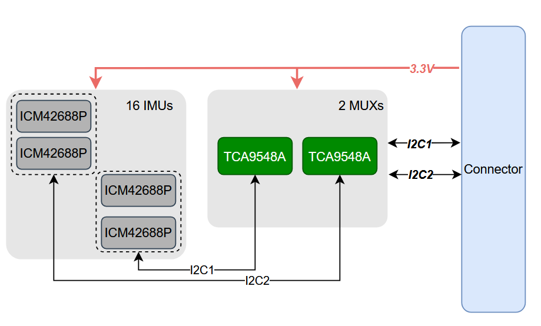
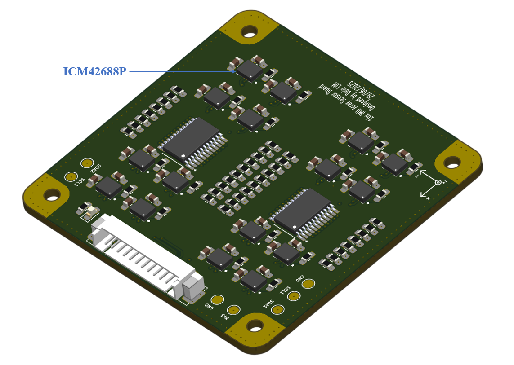
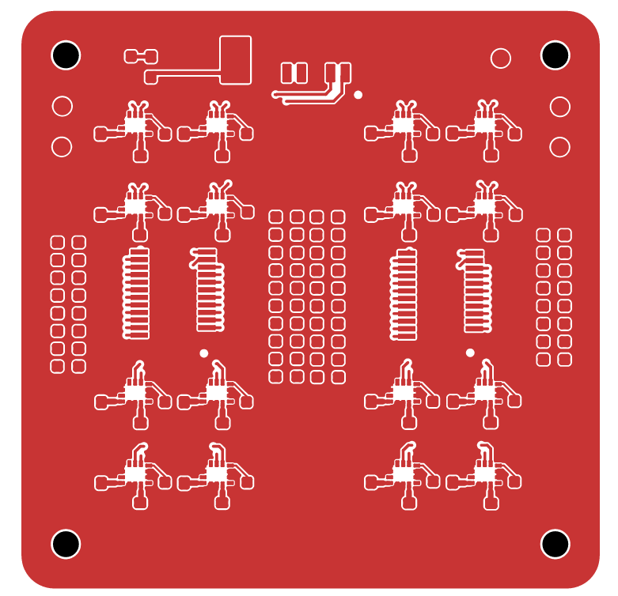
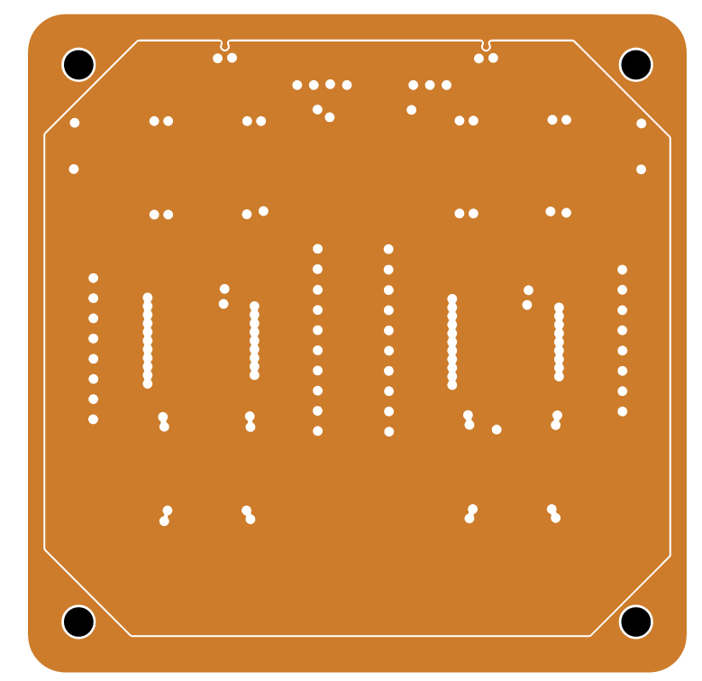
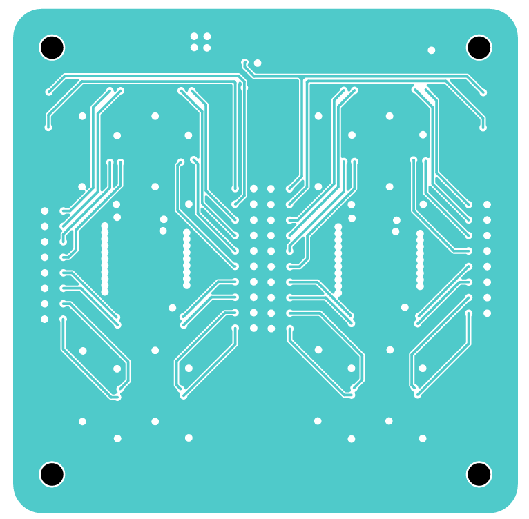
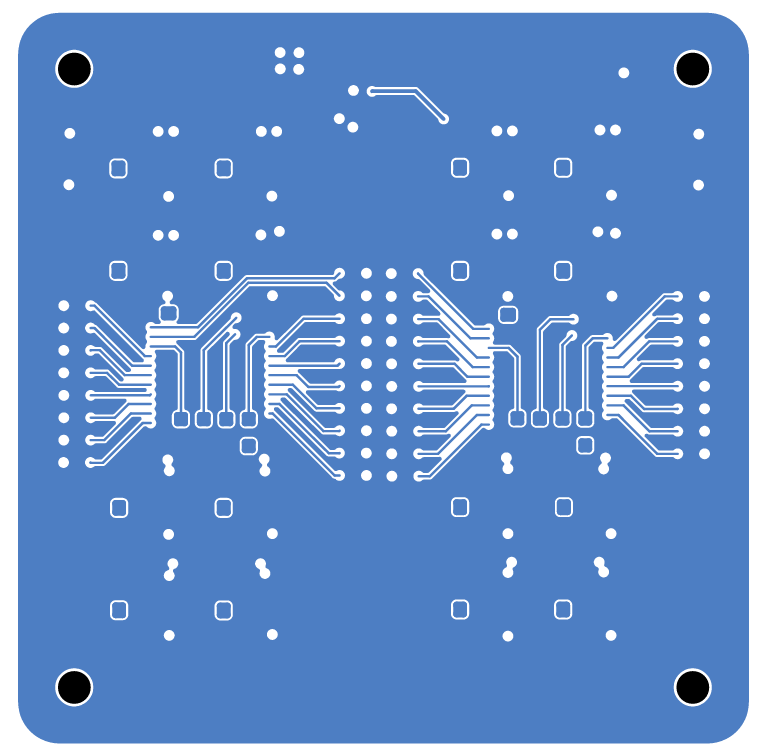

# 16x IMU Sensor Board
This board based on use IMU sensor (ICM42688-P) and Multiplexer (TCA9548A)

## IMU Array Sensor Block Diagram

## IMU Array Sensor Structure

The PCB is designed with a 6-layer stackup:

- **Layer 1**: Top Component Layer - Primary component placement and routing
- **Layer 2**: Ground Plane - Provides ground reference and shielding
- **Layer 3**: Signal Layer - Internal signal routing
- **Layer 4**: Power Plane - Power distribution and filtering
- **Layer 5**: Signal Layer - Additional internal signal routing
- **Layer 6**: Bottom Layer - Secondary component placement and routing

This multi-layer design ensures proper signal integrity, power distribution, and electromagnetic compatibility for the IMU array sensor system.

### PCB Design Overview

**Complete PCB Layout:**

### PCB Layer Images

**Layer 1 - Top Component Layer:**

**Layer 3 - Signal Layer:**

**Layer 4 - Power Plane:**

**Layer 6 - Bottom Layer:**

## Note

## Firmware Check

To verify the hardware connectivity of the IMU array sensor board, upload the provided firmware to your STM32 microcontroller:

- **Binary file**: `fimware_check/STM32F401.bin`
- **Hex file**: `fimware_check/STM32F401.hex`

Upload either the `.bin` or `.hex` file to your STM32F401 microcontroller to test and validate the hardware connectivity of all IMU sensors in the array. This firmware will help you verify that:
- All IMU sensors are properly connected
- The I2C multiplexer (TCA9548A) is functioning correctly
- Communication with each sensor channel is working as expected

### Expected Output

The expected result shows channel 7 of both multiplexers working correctly with sensors at address 0x68, demonstrating proper hardware connectivity and communication with the IMU array.

## References
