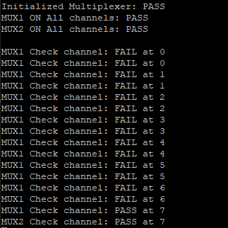

# 16x IMU Sensor Board
This board based on use IMU sensor (ICM42688-P) and Multiplexer (TCA9548A)

## IMU Array Sensor Block Diagram

## IMU Array Sensor Structure

## Note

## Firmware Check

To verify the hardware connectivity of the IMU array sensor board, upload the provided firmware to your STM32 microcontroller:

- **Binary file**: `fimware_check/STM32F401.bin`
- **Hex file**: `fimware_check/STM32F401.hex`

Upload either the `.bin` or `.hex` file to your STM32F401 microcontroller to test and validate the hardware connectivity of all IMU sensors in the array. This firmware will help you verify that:
- All IMU sensors are properly connected
- The I2C multiplexer (TCA9548A) is functioning correctly
- Communication with each sensor channel is working as expected

### Expected Output

The expected result shows channel 7 of both multiplexers working correctly with sensors at address 0x68, demonstrating proper hardware connectivity and communication with the IMU array.

## References
